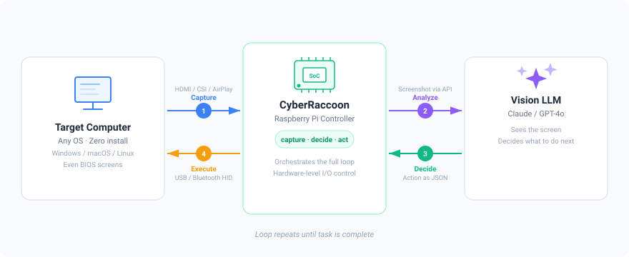

# CyberRaccoon

AI-powered computer control via Raspberry Pi — capture the screen, let a vision LLM decide what to do, and execute keyboard/mouse input as a hardware device. **Zero software installation on the target machine.** Works with any OS: Windows, macOS, Linux, even BIOS and boot screens.

## How It Works

<p align="center">
  
</p>

CyberRaccoon runs a synchronous **capture → decide → act** loop:

1. **Capture** the target computer's screen (HDMI capture card, CSI camera, or AirPlay mirroring)
2. **Analyze** the screenshot with a vision LLM, which understands the screen context
3. **Decide** the next action (click, type, scroll, key combo) returned as JSON
4. **Execute** the action as real keyboard/mouse input via USB HID Gadget or Bluetooth HID

The loop repeats until the task is complete. The target computer sees CyberRaccoon as a regular keyboard and mouse — no drivers, agents, or network access required.

## Features

- **3 capture sources** — HDMI capture card, Raspberry Pi CSI camera, or AirPlay screen mirroring
- **2 HID transports** — USB HID Gadget (wired) or Bluetooth HID (wireless)
- **Multiple LLM providers** — Anthropic (Claude), OpenAI (GPT-4o), or any OpenAI-compatible API
- **Input humanization** — Bezier curve mouse movements, variable typing rhythm, jitter, and overshoot to avoid bot detection
- **Web UI + CLI** — Remote task management via browser or interactive terminal REPL
- **Configurable** — CLI flags, environment variables, or YAML config file (3-tier precedence)

## Hardware Requirements

| Component | Purpose | Notes |
|-----------|---------|-------|
| Raspberry Pi 5 (or Pi 4B) | Main controller | Pi 4B works for USB mode; Pi 5 recommended |
| USB HDMI capture card | Screen capture | Optional (~$10–20); or use CSI camera / AirPlay instead |
| HDMI-to-CSI module | Screen capture | Optional; alternative to USB capture card, uses Pi CSI port |
| USB OTG cable | USB HID output | Optional, Pi 4B only — Pi 5 USB-C is power-only |

> **Pi 5 note:** The USB-C port on Pi 5 is power-only and cannot be used for USB HID Gadget. Use Bluetooth HID (`--transport bt`) instead, or use a Pi 4B for USB mode.

## Quick Start

### 1. Clone and install

```bash
git clone https://github.com/ChaoticPixelIO/cyberRaccoon.git
cd cyberRaccoon
pip install -r requirements.txt
```

### 2. Set your API key

```bash
# Anthropic (default)
export ANTHROPIC_API_KEY="sk-ant-..."

# OpenAI (if using --provider openai)
export OPENAI_API_KEY="sk-..."
```

### 3. Set up hardware (run once on the Pi)

```bash
# USB HID Gadget (Pi 4B)
sudo scripts/setup_gadget.sh

# Bluetooth HID (Pi 4B/5)
sudo scripts/setup_bluetooth.sh

# AirPlay capture (optional)
sudo scripts/setup_airplay.sh
```

### 4. Run a task

```bash
# USB mode (Pi 4B)
python main.py --task "Open Notepad and type Hello World"

# Bluetooth mode (Pi 5)
python main.py --task "Open Notepad and type Hello World" --transport bt

# AirPlay + Bluetooth
python main.py --task "Open Safari" --source airplay --transport bt
```

## Usage

### Three modes

```bash
# One-shot task
python main.py --task "Click the Start menu"

# Web UI (FastAPI + Alpine.js)
python main.py --web
python main.py --web --host 0.0.0.0 --port 8080

# Interactive CLI REPL
python main.py --cli

# Web + CLI together
python main.py --web --cli
```

### CLI flags

**Capture:**

| Flag | Default | Description |
|------|---------|-------------|
| `--source` | `hdmi` | Capture source: `hdmi`, `csi`, or `airplay` |
| `--device` | `0` | Device index for HDMI/CSI |
| `--rtp-port` | `5004` | RTP port for AirPlay video stream |

**LLM:**

| Flag | Default | Description |
|------|---------|-------------|
| `--provider` | `anthropic` | LLM provider: `anthropic` or `openai` |
| `--model` | `claude-opus-4-6` | Model name |
| `--api-key` | env var | API key (or set `ANTHROPIC_API_KEY` / `OPENAI_API_KEY`) |
| `--base-url` | — | Custom API base URL (OpenAI-compatible) |

**Agent:**

| Flag | Default | Description |
|------|---------|-------------|
| `--max-steps` | `50` | Maximum steps per task |
| `--timeout` | `600` | Task timeout in seconds |
| `--delay` | `1.0` | Post-action delay in seconds |

**Executor:**

| Flag | Default | Description |
|------|---------|-------------|
| `--transport` | `usb` | Transport: `usb` or `bt` (Bluetooth) |
| `--keyboard` | `/dev/hidg0` | Keyboard HID device path (USB mode) |
| `--mouse` | `/dev/hidg1` | Mouse HID device path (USB mode) |

**Humanization:**

| Flag | Default | Description |
|------|---------|-------------|
| `--humanize` | off | Enable input humanization |
| `--humanize-preset` | `normal` | Preset: `subtle`, `normal`, or `aggressive` |

**Web server:**

| Flag | Default | Description |
|------|---------|-------------|
| `--host` | `0.0.0.0` | Web server bind address |
| `--port` | `8000` | Web server port |

**Misc:**

| Flag | Description |
|------|-------------|
| `--verbose` / `-v` | Enable debug logging |

## Web UI

The web UI provides remote task management from any browser on the same network.

```bash
python main.py --web
# Open http://<pi-ip>:8000 in your browser
```

**Tabs:**

- **Task** — Submit tasks, view live progress with step-by-step screenshots
- **Config** — Edit capture source, LLM provider, transport settings
- **Logs** — Real-time log streaming via WebSocket
- **Wi-Fi** — Network configuration (for headless Pi setup)

<!-- TODO: Add screenshot -->

## Capture Sources

| Source | Best for | Hardware | Software |
|--------|----------|----------|----------|
| HDMI | Desktop/laptop with HDMI out | USB HDMI capture card | — |
| CSI | HDMI input via CSI port (no USB needed) | HDMI-to-CSI module | picamera2 |
| AirPlay | macOS/iOS wireless mirroring | — | uxplay + GStreamer (`setup_airplay.sh`) |

## Input Humanization

CyberRaccoon can simulate human-like input patterns to avoid bot detection on websites and applications.

- **Mouse:** Bezier curve movements, overshoot-then-correct, micro-tremor before clicks, click jitter
- **Keyboard:** Variable inter-key timing, punctuation pauses, word boundary pauses, speed ramp-up

### Presets

| Preset | Mouse | Keyboard | Use case |
|--------|-------|----------|----------|
| `subtle` | Light curves, minimal jitter | Low timing variance | General automation |
| `normal` | Natural curves, overshoot 10% | Moderate variance, punctuation pauses | Default for most tasks |
| `aggressive` | Slow movements, high jitter, 25% overshoot | Slow typing, high variance | Sites with aggressive bot detection |

```bash
python main.py --task "Fill out the form" --humanize
python main.py --task "Fill out the form" --humanize --humanize-preset aggressive
```

Or via environment variable: `CYBERRACCOON_HUMANIZE=1`

## For Developers

```bash
# Run all tests
pytest tests/

# Run a specific test file
pytest tests/test_capture/test_screen_capture.py

# Module CLI tools (test hardware/APIs independently)
python -m capture.cli --device 0 --output screenshot.jpg
python -m agent.cli --image screenshot.jpg --goal "Open Notepad" --provider anthropic
python -m executor.cli click 640 360
python -m executor.cli type "hello world"
python -m executor.cli key ctrl c
```

### Architecture

Five modules in a hub-and-spoke pattern — M2 (Vision Agent) orchestrates everything:

```
HDMI Input → [M1 Capture] → [M2 Vision Agent] ←→ [M3 LLM Client]
                                    ↓
                             [M4 Executor] → USB/BT HID → Target
                                    ↑
                             [M5 Web UI]
```

## Configuration Reference

### Environment Variables

| Variable | Default | Description |
|----------|---------|-------------|
| `ANTHROPIC_API_KEY` | — | **Required** for Anthropic provider |
| `OPENAI_API_KEY` | — | **Required** for OpenAI provider |
| `CYBERRACCOON_PROVIDER` | `anthropic` | LLM provider (`anthropic` or `openai`) |
| `CYBERRACCOON_MODEL` | `claude-opus-4-6` | Model name |
| `CYBERRACCOON_BASE_URL` | — | Custom API base URL |
| `CYBERRACCOON_SOURCE` | `hdmi` | Capture source (`hdmi`, `csi`, `airplay`) |
| `CYBERRACCOON_DEVICE` | `0` | Device index for HDMI/CSI |
| `CYBERRACCOON_TRANSPORT` | `usb` | HID transport (`usb` or `bt`) |
| `CYBERRACCOON_HUMANIZE` | `0` | Enable humanization (`1` to enable) |
| `CYBERRACCOON_WEB_HOST` | `0.0.0.0` | Web server bind address |
| `CYBERRACCOON_WEB_PORT` | `8000` | Web server port |

Config precedence: **environment variables > YAML file > dataclass defaults**

## License

MIT
