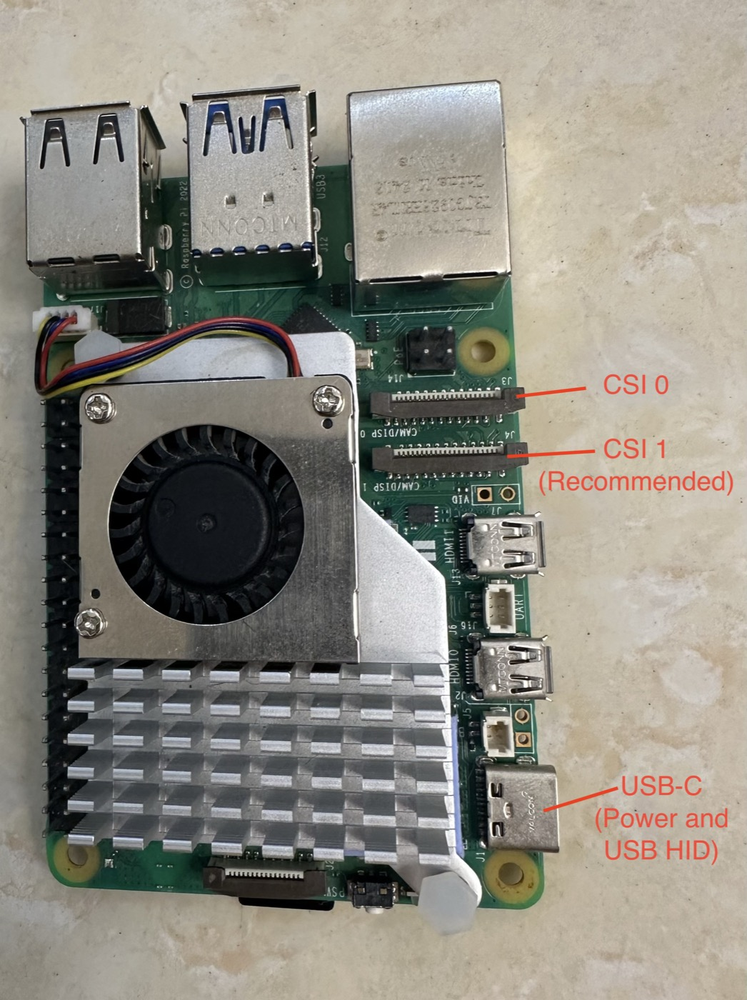
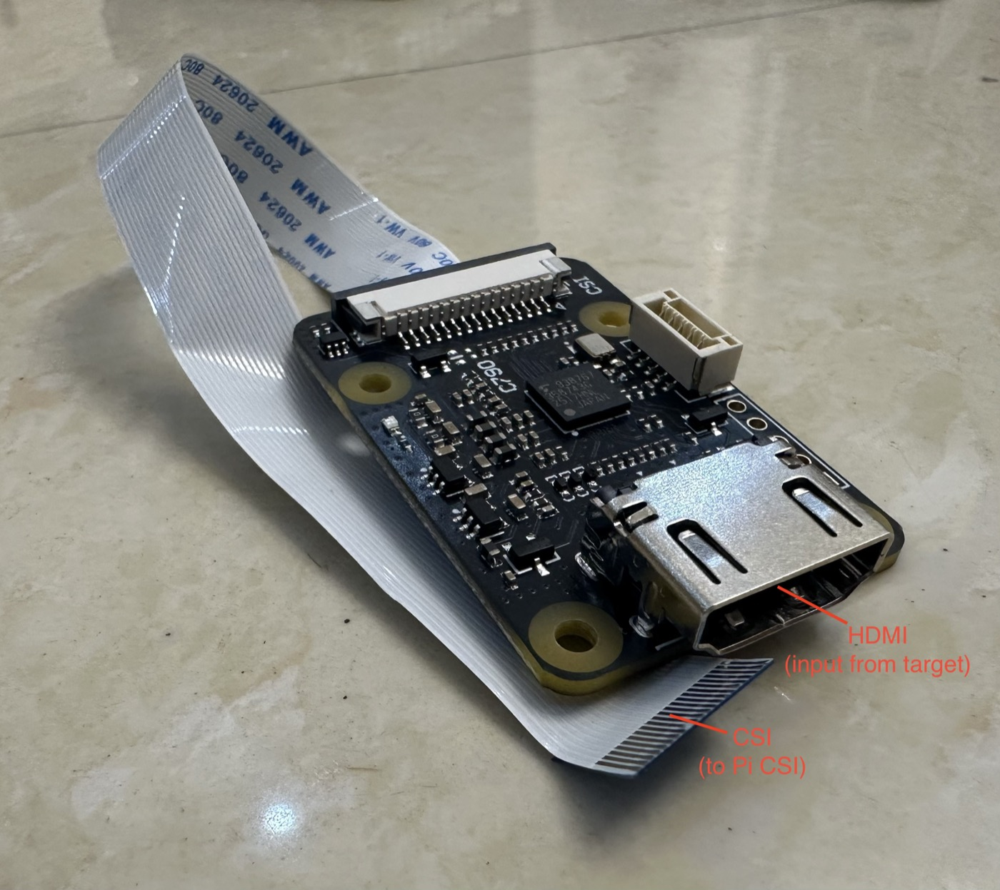
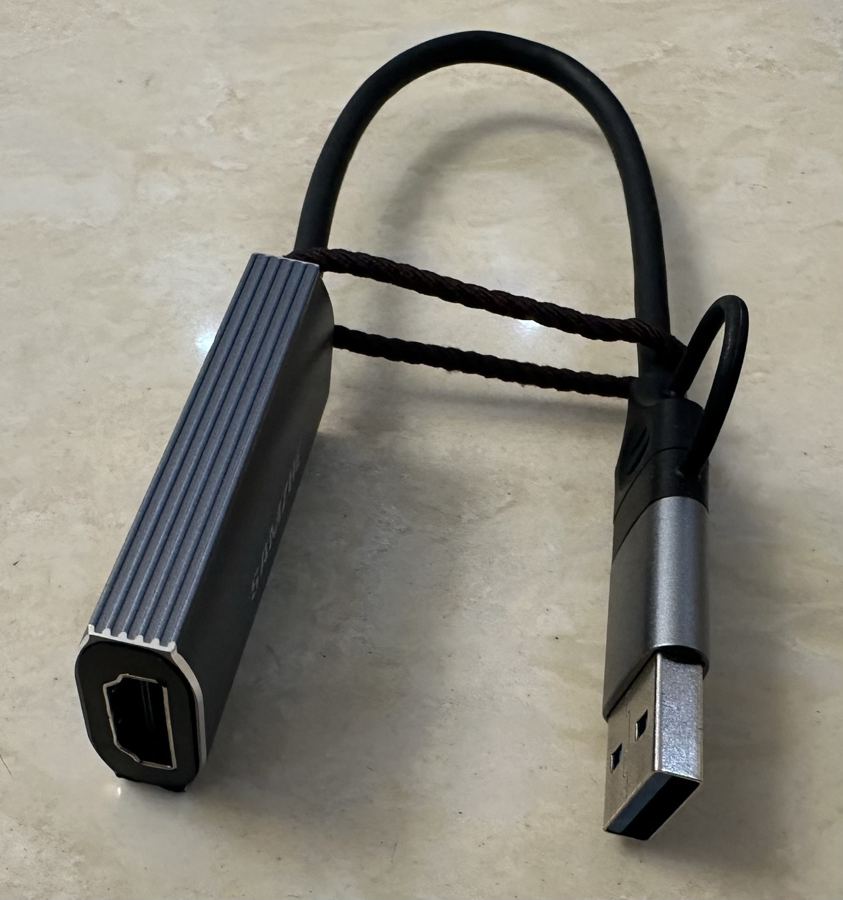
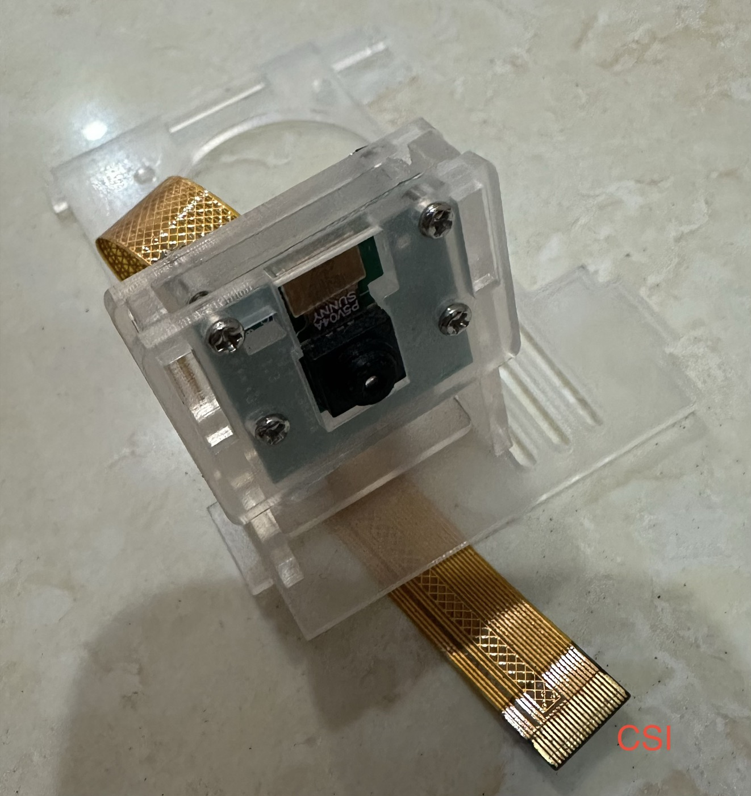
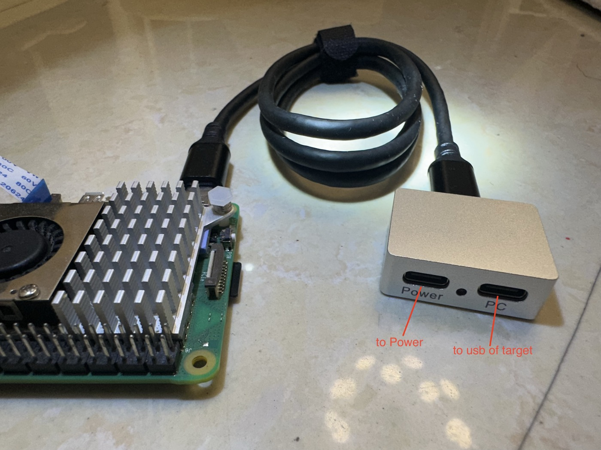

# CyberRaccoon

AI-powered computer control via Raspberry Pi — capture the screen, let a vision LLM decide what to do, and execute keyboard/mouse input as a hardware device. **Zero software installation on the target machine.** Works with any OS: Windows, macOS, Linux, even BIOS and boot screens.

## How It Works

<p align="center">
  
</p>

CyberRaccoon runs a synchronous **capture → decide → act** loop:

1. **Capture** the target computer's screen (HDMI-to-CSI bridge, AirPlay, USB capture card, or Pi camera module)
2. **Analyze** the screenshot with a vision LLM, which understands the screen context
3. **Decide** the next action (click, type, scroll, key combo) returned as JSON
4. **Execute** the action as real keyboard/mouse input via USB HID Gadget or Bluetooth HID

The loop repeats until the task is complete. The target computer sees CyberRaccoon as a regular keyboard and mouse — no drivers, agents, or network access required.

## Features

- **4 capture sources** — HDMI-to-CSI bridge (TC358743), AirPlay mirroring, USB HDMI capture card (UVC), or Pi camera module (picamera2)
- **2 HID transports** — Bluetooth HID (wireless) or USB HID Gadget (wired; a USB power/data splitter is recommended so you can swap targets without power-cycling the Pi, but a single USB-C-to-USB cable also works)
- **Multiple LLM providers** — OpenAI (GPT), Anthropic (Claude), or any OpenAI-compatible API
- **Input humanization** — Bezier curve mouse movements, variable typing rhythm, jitter, and overshoot to avoid bot detection
- **Web UI + CLI** — Remote task management via browser or interactive terminal REPL
- **Configurable** — CLI flags, environment variables, or persistent YAML config (see [Configuration Reference](#configuration-reference))

## Hardware Requirements

| | Component | Required? | Purpose | Notes |
|---|-----------|-----------|---------|-------|
| <a href="docs/images/raspberry-pi-5.jpg"></a> | Raspberry Pi 5 | **Required** | Main controller | Only Pi 5 is tested |
| <a href="docs/images/hdmi-csi-bridge.jpg"></a> | HDMI-to-CSI bridge (TC358743) | Optional | HDMI capture via Pi CSI port | Recommended capture path; no USB needed |
| <a href="docs/images/usb-video-capture.jpg"></a> | USB HDMI capture card (UVC) | Optional | HDMI capture via USB | ~$10–20; capture path still being validated |
| <a href="docs/images/pi-camera.jpg"></a> | Raspberry Pi Camera Module | Optional | Capture a physical screen via picamera2 | Capture path still being validated |
| <a href="docs/images/usb-splitter.jpg"></a> | USB power/data splitter cable | Recommended | USB HID output (Gadget mode) | External power to the Pi, separate data cable to the target — lets you swap the data cable to another target without power-cycling the Pi. A single USB cable from the Pi USB-C to the target also works (carries power + data; target side USB-C or USB-A), but the Pi may log under-voltage warnings and changing target requires powering off the Pi. |

> **Minimal setup (no extra hardware):** A Raspberry Pi 5 alone is enough — pair it as a wireless keyboard/mouse over Bluetooth and capture the target screen via AirPlay (macOS/iOS only). All other capture sources and the USB HID transport need the optional hardware above.

## Quick Start

### 1. Install on the Pi (one command)

SSH into your Pi (or open a terminal on it) and run:

```bash
curl -sSL https://raw.githubusercontent.com/ChaoticPixelIO/cyberRaccoon/main/install.sh -o install.sh
bash install.sh
```

> Run as your normal user — **not** with `sudo`. The installer asks for
> `sudo` only where it's needed (apt install, systemd unit).

The installer:
- installs system prerequisites (`python3-opencv`, `python3-dbus`, `python3-gi`, …)
- clones the repo to `~/cyberRaccoon`
- creates a venv with `--system-site-packages` and installs the package
- registers a systemd service so the Web UI auto-starts on boot

When it finishes it prints the URL, e.g. `http://raspberrypi.local:8000`.

**Already cloned the repo?** Just run `./install.sh` from inside the repo.

**On macOS (development only):** skip the installer and run `pip install -e ".[dev]"` manually.

### 2. Set up hardware from the Web UI

Open the printed URL in your browser and go to the **Status** tab. The
**Hardware Setup** section lists each component (Bluetooth HID, USB HID
Gadget, CSI HDMI, AirPlay) with its live status and, for anything that
needs setup, the exact command to run on the Pi:

```bash
sudo scripts/setup.sh --all        # set up everything applicable
# or per component:
sudo scripts/setup.sh --bt
sudo scripts/setup.sh --csi        # reboot required after this one
sudo scripts/setup.sh --airplay
```

The Status page refreshes every 10 seconds — run the command, glance at
the browser, watch the row turn green.

### 3. Configure the LLM

Open the **Config** tab and fill in your API key, provider, and model. Settings are saved to `~/.cyberraccoon/config.yaml` with `0o600` permissions.

- **Default provider:** OpenAI, default model `gpt-5.5`.
- **Switch to Anthropic:** change the Provider dropdown in the Config tab. Per‑provider keys are remembered so switching back doesn't lose them.
- **Custom model:** type it into the Model field, or pass `--model` on the CLI.

### 4. Run a task

In the **Task** tab:

1. Pick your **capture source** (`csi`, `airplay`, `uvc`, or `picamera`) and **HID transport** (Bluetooth or USB Gadget).
2. Enter a task (e.g., *"Open Notepad and type Hello World"*) and submit — watch the step-by-step progress.

## Usage

### Web UI (recommended)

The Web UI is the primary way to use CyberRaccoon — it bundles live task progress, configuration, skills management, and log streaming into one place. The Quick Start launches it on `0.0.0.0:8000`; to bind a different host or port:

```bash
python -m cyberraccoon --web --host 0.0.0.0 --port 8080
```

<p align="center">
  
</p>

**Tabs:**

- **Task** — Submit tasks, view live progress with step-by-step screenshots
- **Config** — Edit capture source, LLM provider, transport settings
- **Skills** — Browse, enable, edit, and create application skills
- **Status** — System overview and live **Hardware Setup** checklist (Bluetooth, USB Gadget, CSI, AirPlay) with per-component fix commands
- **Debug** — Real-time log streaming via WebSocket with level/module filtering

### Command line

The CLI reads the API key from `~/.cyberraccoon/config.yaml` (the same file the Web UI's Config tab writes to). Configure your key there once, or pass a one‑off with `--api-key`.

```bash
# One-shot task
python -m cyberraccoon --task "Click the Start menu"

# Interactive CLI REPL
python -m cyberraccoon --cli

# Web + CLI together
python -m cyberraccoon --web --cli
```

### CLI flags

**Capture:**

| Flag | Default | Description |
|------|---------|-------------|
| `--source` | `uvc` | Capture source: `csi`, `airplay`, `uvc`, or `picamera` (see [Capture Sources](#capture-sources)) |
| `--device` | `0` | Device index for UVC/CSI |
| `--rtp-port` | `5004` | RTP port for AirPlay video stream |

**LLM:**

| Flag | Default | Description |
|------|---------|-------------|
| `--provider` | `openai` | LLM provider: `openai` or `anthropic` |
| `--model` | `gpt-5.5` | Any OpenAI- or Anthropic-compatible model ID |
| `--api-key` | yaml | API key (falls back to `~/.cyberraccoon/config.yaml`) |
| `--base-url` | — | Custom API base URL (OpenAI-compatible) |
| `--protocol` | `auto` | Protocol mode: `auto`, `native` (computer-use tool), or `prompt` (prompt-based) |
| `--no-cache` | (cache on) | Disable Anthropic prompt caching |

**Agent:**

| Flag | Default | Description |
|------|---------|-------------|
| `--max-steps` | `50` | Maximum steps per task |
| `--timeout` | `600` | Task timeout in seconds |
| `--delay` | `1.0` | Post-action delay in seconds |

**Executor:**

| Flag | Default | Description |
|------|---------|-------------|
| `--transport` | `usb` | Transport: `usb` or `bt` (Bluetooth) |
| `--hid-device` | `/dev/hidg0` | HID device path for USB mode (combined keyboard+mouse via Report IDs) |
| `--target-os` | `auto` | Target OS for the clipboard bridge (used for non-ASCII text): `auto`, `windows`, `macos`, `linux` |

**Humanization:**

| Flag | Default | Description |
|------|---------|-------------|
| `--humanize` | off | Enable input humanization |
| `--humanize-preset` | `normal` | Preset: `subtle`, `normal`, or `aggressive` |

**Web server:**

| Flag | Default | Description |
|------|---------|-------------|
| `--host` | `0.0.0.0` | Web server bind address |
| `--port` | `8000` | Web server port |

**Misc:** `--verbose` / `-v` enables debug logging.

## Capture Sources

| Source (`--source`) | Status | Best for | Hardware |
|---------------------|--------|----------|----------|
| `csi` | Tested | HDMI input via Pi CSI port (no USB needed) | HDMI-to-CSI bridge (TC358743) |
| `airplay` | Tested | macOS/iOS wireless mirroring | None (software only: uxplay + GStreamer) |
| `uvc` | **WIP** | Desktop/laptop HDMI out via USB capture | USB HDMI capture card (UVC) |
| `picamera` | **WIP** | Pi camera module aimed at a physical screen | Raspberry Pi Camera Module |

> **Note:** `csi` and `airplay` are the recommended capture methods today. `uvc` and `picamera` are still being validated on the current Pi 5 setup. The CLI default is `--source uvc`, so pass `--source csi` or `--source airplay` explicitly until UVC validation completes.

## Input Humanization

CyberRaccoon can simulate human-like input patterns to avoid bot detection on websites and applications.

- **Mouse:** Bezier curve movements, overshoot-then-correct, micro-tremor before clicks, click jitter
- **Keyboard:** Variable inter-key timing, punctuation pauses, word boundary pauses, speed ramp-up

### Presets

| Preset | Mouse | Keyboard | Use case |
|--------|-------|----------|----------|
| `subtle` | Light curves, minimal jitter | Low timing variance | General automation |
| `normal` | Natural curves, overshoot 10% | Moderate variance, punctuation pauses | Default for most tasks |
| `aggressive` | Slow movements, high jitter, 25% overshoot | Slow typing, high variance | Sites with aggressive bot detection |

```bash
# Default preset
python -m cyberraccoon --task "Fill out the form" --humanize

# Aggressive preset
python -m cyberraccoon --task "Fill out the form" --humanize --humanize-preset aggressive

# Or enable globally via environment variable
export CYBERRACCOON_HUMANIZE=1
```

## For Developers

```bash
# Run all tests
pytest tests/

# Run a specific test file
pytest tests/test_capture/test_screen_capture.py

# Module CLI tools (test hardware/APIs independently — capture/executor commands run on the Pi)
python -m cyberraccoon.capture.cli --source csi --output screenshot.jpg
python -m cyberraccoon.agent.cli --image screenshot.jpg --goal "Open Notepad"
sudo -E python -m cyberraccoon.executor.cli click 640 360
sudo -E python -m cyberraccoon.executor.cli type "hello world"
sudo -E python -m cyberraccoon.executor.cli key ctrl c
```

> Executor commands need root to write to `/dev/hidg0`; use `sudo -E` to preserve the venv environment.

### Architecture

Five modules in a hub-and-spoke pattern — M2 (Vision Agent) orchestrates everything:

```
Target screen → [M1 Capture] → [M2 Vision Agent] ←→ [M3 LLM Client]
                                       ↓
                                [M4 Executor] → USB/BT HID → Target
```

`[M5 Web UI]` connects to `[M2 Vision Agent]` over WebSocket + REST for status streaming and remote task control.

## Configuration Reference

The most-used CLI flags also accept `CYBERRACCOON_*` environment variables (full list below). Persistent UI config lives at `~/.cyberraccoon/config.yaml` (override the path with `CYBERRACCOON_CONFIG_PATH`).

### Environment Variables

| Variable | Default | Description |
|----------|---------|-------------|
| `CYBERRACCOON_PROVIDER` | `openai` | Active LLM provider name (`openai`, `anthropic`, or custom). API key / model / base URL are **not** read from env — configure them in the Config tab (`~/.cyberraccoon/config.yaml`). |
| `CYBERRACCOON_SOURCE` | `uvc` | Capture source — `csi`, `airplay`, `uvc`, or `picamera` (`csi`/`airplay` recommended; see [Capture Sources](#capture-sources)) |
| `CYBERRACCOON_DEVICE` | `0` | Device index for UVC/CSI |
| `CYBERRACCOON_TRANSPORT` | `usb` | HID transport (`usb` or `bt`) |
| `CYBERRACCOON_TARGET_OS` | `auto` | Target OS for clipboard bridge (`auto`, `windows`, `macos`, `linux`) |
| `CYBERRACCOON_HUMANIZE` | `0` | Enable humanization (`1` to enable) |
| `CYBERRACCOON_WEB_HOST` | `0.0.0.0` | Web server bind address |
| `CYBERRACCOON_WEB_PORT` | `8000` | Web server port |
| `CYBERRACCOON_CONFIG_PATH` | `~/.cyberraccoon/config.yaml` | YAML config file path |

Config precedence: **CLI flags > environment variables > YAML file > dataclass defaults** (API keys, models, and base URLs are yaml-only — no env fallback; see the row for `CYBERRACCOON_PROVIDER` above).

## Further Reading

- [`docs/user-guide.md`](docs/user-guide.md) — Full English user guide

## License

[Apache 2.0](LICENSE)
