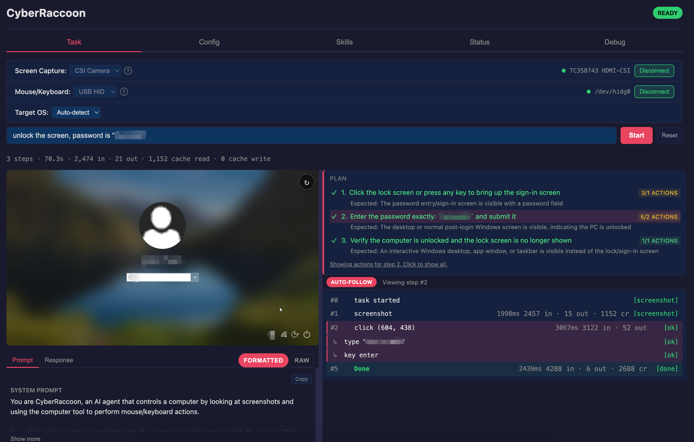

# CyberRaccoon User Guide

This guide covers installation, configuration, and usage of CyberRaccoon in detail. For a quick overview, see the [README](../README.md).

## Table of Contents

- [Installation](#installation)
- [Hardware Setup](#hardware-setup)
  - [USB HID Gadget](#usb-hid-gadget)
  - [Bluetooth HID](#bluetooth-hid)
  - [AirPlay Capture](#airplay-capture)
- [Configuration](#configuration)
  - [API Keys](#api-keys)
  - [Config File](#config-file)
  - [Environment Variables](#environment-variables)
  - [Config Precedence](#config-precedence)
- [Running Tasks](#running-tasks)
  - [Web UI](#web-ui)
  - [One-Shot Mode](#one-shot-mode)
  - [Interactive CLI](#interactive-cli)
- [Capture Sources](#capture-sources)
  - [CSI HDMI (TC358743)](#csi-hdmi-tc358743--recommended)
  - [AirPlay](#airplay)
  - [HDMI-UVC](#hdmi-uvc-usb-capture-card)
- [HID Transports](#hid-transports)
  - [USB](#usb)
  - [Bluetooth](#bluetooth)
- [LLM Protocols](#llm-protocols)
- [Skills](#skills)
- [Input Humanization](#input-humanization)
- [Non-ASCII Text Input](#non-ascii-text-input)
- [CLI Reference](#cli-reference)
- [Troubleshooting](#troubleshooting)

---

## Installation

```bash
git clone https://github.com/ChaoticPixelIO/cyberRaccoon.git
cd cyberRaccoon
```

### System prerequisites (Raspberry Pi)

```bash
# OpenCV with GStreamer support (required for AirPlay capture)
sudo apt install python3-opencv

# Bluetooth HID dependencies (installed automatically by scripts/setup.sh --bt)
sudo apt install bluez libcap2-bin python3-dbus python3-gi
```

### Python setup

On Raspberry Pi, create a venv with system site-packages (required for OpenCV with GStreamer support):

```bash
python3 -m venv --system-site-packages venv
source venv/bin/activate
pip install -e .
```

> **Do not** `pip install opencv-python` inside the venv. It shadows the system OpenCV package and loses GStreamer support, which breaks AirPlay capture. If accidentally installed, fix with:
> ```bash
> pip uninstall opencv-python opencv-python-headless
> ```

---

## Hardware Setup

All setup is managed through a single entry point. Each component is idempotent and safe to run multiple times.

```bash
# Interactive — asks what to configure
sudo scripts/setup.sh

# Or specify components directly
sudo scripts/setup.sh --bt              # Bluetooth HID
sudo scripts/setup.sh --gadget          # USB HID Gadget (needs splitter on Pi 5)
sudo scripts/setup.sh --airplay         # AirPlay capture
sudo scripts/setup.sh --csi             # CSI HDMI capture (TC358743)
sudo scripts/setup.sh --all             # everything applicable
```

### USB HID Gadget

> **Note:** On Pi 5, USB Gadget requires a USB power/data splitter cable (the USB-C port is power-only by default). Bluetooth HID (`--transport bt`) is the simpler option and requires no extra hardware.

Creates `/dev/hidg0` so the Pi appears as a USB keyboard and mouse to the target computer. A single combined HID device is used with Report IDs (ID 1 = keyboard, ID 2 = mouse) for cross-platform compatibility (macOS requires this approach).

```bash
sudo scripts/setup.sh --gadget
```

What it does:

1. Detects Pi model (on Pi 5, requires USB power/data splitter cable)
2. Loads the `libcomposite` kernel module
3. Creates a USB Gadget at `/sys/kernel/config/usb_gadget/cyber_raccoon`
4. Configures a combined HID function with Report ID descriptors:
   - Report ID 1: Keyboard (modifier + 6 keycodes)
   - Report ID 2: Absolute-coordinate mouse (1280x720 coordinate space)
5. Binds the gadget to the USB Device Controller

Verify the device exists after running:

```bash
ls -la /dev/hidg0

### Bluetooth HID

Configures the Pi as a Bluetooth keyboard+mouse composite device.

```bash
sudo scripts/setup.sh --bt
```

What it does:

1. Disables the BlueZ input plugin (prevents HID profile conflicts)
2. Sets the Bluetooth device class to keyboard+mouse composite (0x002540)
3. Sets the device name to "CyberRaccoon"
4. Installs a persistent pairing agent (D-Bus service) for automatic "Just Works" pairing
5. Grants Python the required network capabilities via `setcap`

After running, pair from the target computer:

1. Open Bluetooth settings on the target computer
2. Find and pair "CyberRaccoon"
3. Accept the connection — no PIN required

### AirPlay Capture

Installs `uxplay` (an open-source AirPlay receiver) and GStreamer for video decoding.

```bash
sudo scripts/setup.sh --airplay
```

What it does:

1. Installs `uxplay` and GStreamer plugins (base, good, bad, libav)
2. Installs `python3-opencv` with GStreamer support (system package)
3. Installs and enables the Avahi daemon for mDNS discovery
4. Verifies all components are working

On the source Mac/iPhone/iPad:

- **macOS**: System Settings > General > AirDrop & Handoff > AirPlay Receiver, then use Control Center > Screen Mirroring > "CyberRaccoon"
- **iOS/iPadOS**: Control Center > Screen Mirroring > "CyberRaccoon"

---

## Configuration

### API Keys

Set the API key for your LLM provider:

```bash
# OpenAI (default provider)
export OPENAI_API_KEY="sk-..."

# Anthropic (if using --provider anthropic)
export ANTHROPIC_API_KEY="sk-ant-..."
```

### Config File

CyberRaccoon reads settings from `~/.cyberraccoon/config.yaml`. The file is created automatically when you save settings from the Web UI or CLI REPL.

Example:

```yaml
capture_source: hdmi
executor_transport: bt
target_os: ""                  # auto-detect; or: windows, macos, linux

capture:
  device_index: 0
  target_width: 1280
  target_height: 720
  jpeg_quality: 80

llm:
  provider: openai
  model: ""                    # uses provider default if empty
  base_url: null
  max_tokens: 1024
  temperature: 0.0

agent:
  max_steps: 50
  max_consecutive_failures: 3
  post_action_delay_s: 1.0
  task_timeout_s: 600.0
  protocol_override: auto      # auto, native, or prompt
  enable_cache: true
  skills:
    - blender

executor:
  device: /dev/hidg0              # combined keyboard+mouse HID device
  screen_width: 1280
  screen_height: 720

network:
  web_host: 0.0.0.0
  web_port: 8000
```

Security notes:

- `wifi_password` is never saved to the config file
- `api_key` is excluded by default
- The config file is created with mode `0o600` (owner read/write only)

### Environment Variables

| Variable | Default | Description |
|----------|---------|-------------|
| `CYBERRACCOON_PROVIDER` | `openai` | Active LLM provider. Any string works; built-in model defaults exist for `openai` and `anthropic`. |
| `{PROVIDER}_API_KEY` | — | API key for the given provider. Provider name is uppercased (e.g. `OPENAI_API_KEY`, `ANTHROPIC_API_KEY`, `MINIMAX_API_KEY`). |
| `{PROVIDER}_MODEL` | provider default | Model name for the given provider (e.g. `OPENAI_MODEL=gpt-4o`, `ANTHROPIC_MODEL=claude-sonnet-4-6`). |
| `{PROVIDER}_BASE_URL` | — | Custom API base URL for the given provider (e.g. `OPENAI_BASE_URL` for OpenAI-compatible services like MiniMax, Groq, DeepSeek, Together). |
| `CYBERRACCOON_SOURCE` | `hdmi` | Capture source (`hdmi`, `csi`, `airplay`) |
| `CYBERRACCOON_DEVICE` | `0` | Device index for HDMI/CSI |
| `CYBERRACCOON_TRANSPORT` | `usb` | HID transport (`usb`, `bt`) |
| `CYBERRACCOON_TARGET_OS` | — | Target OS (`windows`, `macos`, `linux`, or empty for auto) |
| `CYBERRACCOON_HUMANIZE` | `0` | Enable humanization (`1` to enable) |
| `CYBERRACCOON_WEB_HOST` | `0.0.0.0` | Web server bind address |
| `CYBERRACCOON_WEB_PORT` | `8000` | Web server port |

### Config Precedence

Settings are merged in this order (highest priority first):

1. **CLI flags** (`--provider openai`, `--max-steps 30`, etc.)
2. **Environment variables** (`CYBERRACCOON_*`)
3. **Config file** (`~/.cyberraccoon/config.yaml`)
4. **Defaults** (hardcoded in dataclasses)

---

## Running Tasks

CyberRaccoon has three operating modes. The Web UI is the recommended way to use CyberRaccoon. `--task` runs a single task and exits. `--web` and `--cli` can be used together.

### Web UI

The Web UI is the primary interface for CyberRaccoon. Start it with:

```bash
python -m cyberraccoon --web
# Open http://<pi-ip>:8000 in your browser
```



The Web UI has five tabs:

**Task** — The main workspace. Connect capture and executor modules, submit tasks, and watch live progress. Each step shows the action, parameters, status, and LLM latency. Click a step to see the full LLM conversation, system prompt, and raw response.

**Config** — Edit LLM, agent, and network settings. Changes are saved to `~/.cyberraccoon/config.yaml`.

**Skills** — Browse, enable, edit, and create application skills. Toggle skills on/off for the current session. Create custom skills that are saved to `~/.cyberraccoon/skills/`.

**Status** — System overview: module readiness, current capture source, transport, LLM provider, task status, and Wi-Fi status.

**Debug** — Real-time log viewer with filtering by level (DEBUG/INFO/WARNING/ERROR) and module (M1-M5). Logs stream via WebSocket.

The Web UI uses REST endpoints for configuration and task control, plus a WebSocket at `/ws` for real-time events (step progress, log messages, status updates).

### One-Shot Mode

Run a single task, print results, and exit:

```bash
python -m cyberraccoon --task "Open Notepad and type Hello World"
```

With options:

```bash
# Use Anthropic instead of OpenAI
python -m cyberraccoon --task "Click Start menu" --provider anthropic

# Use CSI camera for capture
python -m cyberraccoon --task "Open Chrome" --source csi

# Use Bluetooth HID
python -m cyberraccoon --task "Open Safari" --transport bt

# AirPlay capture + Bluetooth HID
python -m cyberraccoon --task "Open Firefox" --source airplay --transport bt

# Custom step/timeout limits
python -m cyberraccoon --task "Fill out form" --max-steps 30 --timeout 600

# With humanization
python -m cyberraccoon --task "Login" --humanize --humanize-preset aggressive

# With application skills
python -m cyberraccoon --task "Edit the 3D model" --skill blender
```

Output shows each step as it executes:

```
============================================================
  CyberRaccoon — AI Computer Control
============================================================
  Task:     Open Notepad and type Hello World
  Source:   CSI TC358743
  Transport: Bluetooth HID
  Limits:   50 steps, 600s timeout
============================================================

Starting task...

  Step  1: click        (46, 695)                  [ok] (1250ms)
  Step  2: type         "notepad"                  [ok] (850ms)
  Step  3: key          enter                      [ok] (120ms)
  Step  4: type         "Hello World"              [ok] (900ms)
  Step  5: done                                    [ok] (80ms)

============================================================
  Result:   OK COMPLETED
  Reason:   Task completed successfully
  Steps:    5
  Tokens:   12840 in / 523 out
  Duration: 14.2s
============================================================
```

### Interactive CLI

Start the REPL:

```bash
python -m cyberraccoon --cli

# Or run both Web UI and CLI together
python -m cyberraccoon --web --cli
```

Available commands:

| Command | Description |
|---------|-------------|
| `task run "goal"` | Start a task |
| `task abort` | Abort the running task |
| `task status` | Show current task status |
| `config show` | Display all settings (secrets masked) |
| `config set KEY VALUE` | Update a setting (e.g. `config set llm.provider anthropic`) |
| `config reset` | Delete config file and revert to defaults |
| `capture test` | Take a test screenshot and show resolution/size |
| `wifi scan` | Scan for available Wi-Fi networks |
| `wifi connect SSID [PASSWORD]` | Connect to a Wi-Fi network |
| `wifi status` | Show Wi-Fi connection status |
| `logs` | Show all logs |
| `logs tail N` | Show last N log lines |
| `logs clear` | Clear log buffer |
| `status` | Show system status |
| `help` | List all commands |
| `quit` / `exit` | Exit the REPL |

Tab completion and command history are available when `prompt_toolkit` is installed.

---

## Capture Sources

### CSI HDMI (TC358743) — Recommended

Captures the target screen via an HDMI-to-CSI bridge module connected to the Pi's CSI port. Works with any OS and even at BIOS/boot screens. No USB port needed.

```bash
python -m cyberraccoon --task "..." --source csi
```

Requirements:

- TC358743 HDMI-to-CSI bridge module
- Connected to CAM0 (2-lane, 720p) or CAM1 (4-lane, 1080p)
- HDMI cable from target computer to TC358743 input
- Setup: `sudo scripts/setup.sh --csi` (requires reboot)

Test capture independently:

```bash
python -m cyberraccoon.capture.cli --source csi --output csi.jpg
```

### AirPlay

Receives screen mirroring from macOS/iOS devices over the network. No cables or capture hardware needed.

```bash
python -m cyberraccoon --task "..." --source airplay
```

Requirements:

- `uxplay` and GStreamer installed (`sudo scripts/setup.sh --airplay`)
- Pi and source device on the same network
- Source device mirroring to "CyberRaccoon"

Two capture modes are used automatically:

- **RTP mode** (uxplay >= 1.73): Decodes video frames in real-time via a GStreamer pipeline
- **File mode** (older uxplay): Reads JPEG files written to disk by uxplay

### HDMI-UVC (USB capture card)

> **Note:** This capture source has not been fully validated on the current Pi 5 setup. It may work but is not guaranteed. Use CSI or AirPlay instead.

Captures the target screen via a USB HDMI capture card using V4L2.

```bash
python -m cyberraccoon --task "..." --source hdmi --device 0
```

Requirements:

- USB HDMI capture card (generic UVC cards, ~$10-20)
- HDMI cable from target computer to capture card
- Capture card plugged into Pi USB port

Test capture independently:

```bash
python -m cyberraccoon.capture.cli --device 0 --output screenshot.jpg
```

---

## HID Transports

### USB

The Pi appears as a USB keyboard and mouse via USB HID Gadget. On Pi 5, this requires a USB power/data splitter cable.

```bash
python -m cyberraccoon --task "..." --transport usb
```

- Combined device: `/dev/hidg0` (Report ID 1 = keyboard, Report ID 2 = mouse)
- Requires `sudo` or appropriate device permissions

> Bluetooth HID is the simpler option on Pi 5 — no extra cables needed.

### Bluetooth

The Pi pairs as a wireless Bluetooth keyboard and mouse. This is the recommended transport on Pi 5.

```bash
python -m cyberraccoon --task "..." --transport bt
```

Connection flow:

1. Run `sudo scripts/setup.sh --bt` (once)
2. Pair "CyberRaccoon" from the target computer's Bluetooth settings
3. Start a task with `--transport bt`
4. The executor waits for the host to connect (60s timeout), then sends HID reports over Bluetooth L2CAP

---

## LLM Protocols

CyberRaccoon supports three protocol modes for communicating with the LLM. The default (`auto`) picks the best one based on provider and model.

| Mode | Flag | Description |
|------|------|-------------|
| Auto | `--protocol auto` | Selects native for supported models, prompt-based otherwise |
| Native | `--protocol native` | Uses the provider's structured computer-use API (Anthropic `computer_20251124` tool or OpenAI Responses API) |
| Prompt | `--protocol prompt` | LLM returns JSON in free text, parsed via 3-level fallback (direct parse, markdown extraction, regex) |

```bash
# Force prompt-based protocol (works with any model)
python -m cyberraccoon --task "..." --protocol prompt
```

Prompt caching (Anthropic) is enabled by default. Disable with `--no-cache`.

---

## Skills

Skills are markdown files that give the LLM app-specific context — UI layouts, keyboard shortcuts, and workflows for specific applications. They are appended to the system prompt.

### Using skills

```bash
# Single skill
python -m cyberraccoon --task "Edit the 3D model" --skill blender
```

Or in the config file:

```yaml
agent:
  skills:
    - blender
```

### Skill lookup order

Each skill is a directory containing a required `SKILL.md` plus any optional resource files (cheat sheets, screenshots, helper scripts).

1. **User skills**: `~/.cyberraccoon/skills/{name}/SKILL.md` (highest priority)
2. **Bundled skills**: `<repo>/skills/{name}/SKILL.md`

User skills override bundled ones with the same name.

### Creating custom skills

Create a directory under `~/.cyberraccoon/skills/` and add a `SKILL.md` file with YAML frontmatter:

```markdown
---
name: myapp
description: One-line summary shown in the Web UI skill list.
---

# My Application

## Window Layout
- Top menu bar with File, Edit, View menus
- Left sidebar with navigation tree
- Main content area in the center
- Status bar at the bottom

## Keyboard Shortcuts
- Ctrl+N: New document
- Ctrl+S: Save
- Ctrl+Z: Undo

## Common Workflows

### Creating a new project
1. Click File > New Project
2. Enter project name in the dialog
3. Click "Create"
```

Save it to `~/.cyberraccoon/skills/myapp/SKILL.md`, then use `--skill myapp`.

The `name` value in frontmatter must match the directory name. Drop any supplementary files (PNG references, sub-prompts, etc.) alongside `SKILL.md` in the same directory.

You can also create and edit skills from the Web UI's Skills tab.

### Listing available skills

```bash
# In the CLI REPL
> status   # shows active skills

# Via the Web UI Skills tab
# Or programmatically:
python -c "from cyberraccoon.agent.skills import list_skills; print(list_skills())"
```

---

## Input Humanization

Humanization simulates human-like input patterns to avoid bot detection. When enabled, mouse movements follow Bezier curves with timing variance and jitter, and typing uses variable inter-key delays with punctuation pauses.

### Enabling

```bash
# Via CLI flag
python -m cyberraccoon --task "..." --humanize

# With a preset
python -m cyberraccoon --task "..." --humanize --humanize-preset aggressive

# Via environment variable
export CYBERRACCOON_HUMANIZE=1
python -m cyberraccoon --task "..."
```

### Presets

| Preset | Mouse behavior | Keyboard behavior | Best for |
|--------|---------------|-------------------|----------|
| `subtle` | Light curves, 1px jitter, 5% overshoot | Low timing variance | General automation |
| `normal` | Natural curves, 2px jitter, 10% overshoot, hand tremor | Moderate variance, punctuation pauses | Most tasks |
| `aggressive` | Slow movements, 4px jitter, 25% overshoot, exaggerated curves | Slow typing, high variance | Aggressive bot detection |

### Fine-tuning

For full control, set individual parameters via environment variables:

```bash
CYBERRACCOON_HUMANIZE=1
CYBERRACCOON_HUMANIZE_SPEED=2.0          # mouse speed multiplier (>1 = slower)
CYBERRACCOON_HUMANIZE_NOISE=1.5          # Bezier curve noise (0 = straight)
CYBERRACCOON_HUMANIZE_JITTER=4           # click jitter in pixels
CYBERRACCOON_HUMANIZE_VARIANCE=0.5       # per-delay variance [0-1]
CYBERRACCOON_HUMANIZE_OVERSHOOT_PROB=0.2 # overshoot probability [0-1]
CYBERRACCOON_HUMANIZE_OVERSHOOT_PX=25    # max overshoot distance in pixels
CYBERRACCOON_HUMANIZE_MICRO_ENABLED=1    # hand tremor before click (0/1)
CYBERRACCOON_HUMANIZE_MICRO_AMP=1.5      # tremor amplitude in pixels
CYBERRACCOON_HUMANIZE_TYPING_SPEED=1.5   # typing speed multiplier (>1 = slower)
CYBERRACCOON_HUMANIZE_TYPING_VARIANCE=0.5
CYBERRACCOON_HUMANIZE_PUNCT_PAUSE=120    # extra ms after punctuation
CYBERRACCOON_HUMANIZE_WORD_PAUSE=60      # extra ms after spaces
```

---

## Non-ASCII Text Input

USB HID keyboards only support US keyboard scancodes. Characters like Chinese, Japanese, Korean, emoji, or accented letters cannot be typed directly. CyberRaccoon handles this automatically via a clipboard bridge.

When the text to type contains non-ASCII characters:

1. ASCII segments are typed normally via HID
2. Non-ASCII segments are copied to the target's clipboard and pasted

The paste method depends on the target OS:

| Target OS | Clipboard command | Paste shortcut |
|-----------|------------------|----------------|
| Windows | PowerShell `Set-Clipboard` | Ctrl+V |
| macOS | `pbcopy` | Cmd+V |
| Linux | `xclip` | Ctrl+V |

Set the target OS explicitly if auto-detection doesn't work:

```bash
python -m cyberraccoon --task "..." --target-os windows
```

Or in the config file:

```yaml
target_os: macos
```

---

## CLI Reference

### Main program

```
python -m cyberraccoon [MODE] [OPTIONS]

Modes (at least one required):
  --task GOAL        Run a single task and exit
  --web              Start the Web UI server
  --cli              Start the interactive CLI REPL

Capture:
  --source {hdmi,csi,airplay}   Capture source (default: hdmi)
  --device N                    Device index (default: 0)
  --rtp-port N                  RTP port for AirPlay (default: 5004)

LLM:
  --provider NAME               openai or anthropic (default: openai)
  --model NAME                  Model name (provider default if omitted)
  --api-key KEY                 API key (default: from env var)
  --base-url URL                Custom API base URL
  --protocol {auto,native,prompt}  Protocol mode (default: auto)
  --no-cache                    Disable Anthropic prompt caching

Agent:
  --max-steps N                 Max steps per task (default: 50)
  --timeout SECONDS             Task timeout (default: 600)
  --delay SECONDS               Post-action delay (default: 1.0)

Executor:
  --transport {usb,bt}          USB HID or Bluetooth HID (default: usb)
  --hid-device PATH             HID device path for USB mode (default: /dev/hidg0)
  --target-os {auto,windows,macos,linux}  Target OS (default: auto)

Humanization:
  --humanize                    Enable input humanization
  --humanize-preset {subtle,normal,aggressive}  Preset (default: normal)

Skills:
  --skill NAME                  Load a skill (repeatable)

Web server:
  --host ADDRESS                Bind address (default: 0.0.0.0)
  --port N                      Port (default: 8000)

Misc:
  --verbose, -v                 Enable debug logging
```

### Module CLI tools

Test individual modules independently:

```bash
# Capture a screenshot
python -m cyberraccoon.capture.cli --device 0 --output screenshot.jpg
python -m cyberraccoon.capture.cli --source csi --output camera.jpg
python -m cyberraccoon.capture.cli --source airplay --output airplay.jpg

# Test LLM with a screenshot
python -m cyberraccoon.agent.cli --image screenshot.jpg --goal "Open Notepad"
python -m cyberraccoon.agent.cli --image screenshot.jpg --goal "Click Start" --provider anthropic

# Execute HID commands directly
python -m cyberraccoon.executor.cli click 640 360
python -m cyberraccoon.executor.cli double_click 640 360
python -m cyberraccoon.executor.cli type "hello world"
python -m cyberraccoon.executor.cli key ctrl c
python -m cyberraccoon.executor.cli key alt f4
python -m cyberraccoon.executor.cli scroll down
python -m cyberraccoon.executor.cli drag 100 200 400 500
```

---

## Troubleshooting

### Capture

**"/dev/video0: No such file or directory"**
- HDMI capture card not connected or not recognized. Check `ls /dev/video*`.
- Try a different device index: `--device 1`.

**Black or blank screenshots**
- Ensure the target computer has video output on the HDMI port.
- Some capture cards take a few seconds to sync after connection.
- HDCP-protected content may appear black — try a CSI camera instead.

**AirPlay: "GStreamer not available"**
- Run `sudo scripts/setup.sh --airplay`.
- Ensure venv was created with `--system-site-packages`.
- If `opencv-python` was pip-installed, uninstall it: `pip uninstall opencv-python opencv-python-headless`.

**AirPlay: device not visible**
- Ensure Avahi is running: `sudo systemctl status avahi-daemon`.
- Pi and source device must be on the same network.

### Executor

**"Permission denied: /dev/hidg0"**
- Run with `sudo`, or add your user to the `hidg_users` group.

**"Failed to open executor" (Bluetooth)**
- Run `sudo scripts/setup.sh --bt`.
- Ensure Bluetooth is enabled: `sudo bluetoothctl power on`.
- Pair "CyberRaccoon" from the target computer first.

**USB HID not working on Pi 5**
- On Pi 5, USB Gadget requires a USB power/data splitter cable. Use `--transport bt` for a simpler setup.

### LLM

**"API key not set"**
- Set `ANTHROPIC_API_KEY` or `OPENAI_API_KEY` in your environment.
- On the Pi, API keys are typically in `~/.apikeys` (sourced by `~/.bashrc`). Use `source ~/.apikeys` before running.

**"Model not found" or 404 errors**
- Check the model name matches your provider. OpenAI models start with `gpt-`, Anthropic models with `claude-`.
- If using a custom base URL, verify it's correct.

### General

**Task completes too quickly without doing anything useful**
- Increase `--max-steps` and `--timeout`.
- Add `--delay 2.0` for slower applications that need time to render.

**Task keeps failing / consecutive failure limit reached**
- Check that the capture source is producing valid screenshots (`python -m cyberraccoon.capture.cli ...`).
- Check that the executor can send input (`python -m cyberraccoon.executor.cli click 640 360`).
- Try a different protocol: `--protocol prompt` for broader model compatibility.

**Web UI not accessible from another device**
- Ensure `--host 0.0.0.0` is set (not `127.0.0.1`).
- Check the Pi's firewall allows the port (default 8000).
- Kill any existing server first: `ps aux | grep "python.*cyberraccoon"` and kill the PID.
